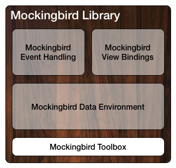

# Mockingbird Toolbox

The Mockingbird Toolbox is a set of general-purpose utility code for use in iOS and Mac OS X applications.

The Toolbox is the lowest-level module in the Mockingbird Library open-source project from Gilt Groupe.

## Highlights

The Mockingbird Toolbox includes:

### Battery & Power Monitoring

The `MBBatteryMonitor` class (iOS only) reports the device’s power status and battery level, and also posts events through the `NSNotificationCenter` when these values change.

### Network Monitoring

The `MBNetworkMonitor` class provides details about the current status of the device’s wifi and (if available) carrier network, and can also be configured to post `NSNotificationCenter` events as network status changes occur.

### Caching

Mockingbird Toolbox provides a simple but extensible caching architecture.

The `MBThreadsafeCache` class implements a basic memory cache that can be safely shared across threads.

A subclass, `MBFilesystemCache`, adds a filesystem backing store to the memory cache.

### Concurrency & Threading

The `MBConcurrentReadWriteCoordinator` class uses Grand Central Dispatch to provide an efficient mechanism for enforcing orderly read/write access to a shared resource.

`MBThreadLocalStorage` provides an interface for safely sharing thread-local storage among unrelated units of code. The class can also be used as a lock-free cache: Objects that are expensive to create, such as `NSDateFormatter` instances, can be cached in thread-local storage without incurring the locking overhead required by a shared object cache like `MBThreadsafeCache`.

### Regular Expressions

The Mockingbird Toolbox provides `NSString` and `NSMutableString` class extensions to help create, manipulate, and execute regular expressions.

These extensions make use of the `MBRegexCache` for reusing regular expressions, which can be expensive to create.

### Message Digests

The `MBMessageDigest` class provides a high-level API for generating MD5 and SHA-1 secure one-way hashes from strings, `NSData` instances, byte arrays, and files.

Class extensions for `NSString` and `NSData` are also provided to simplify creating message digests from existing objects.

### Network Activity Indicator

The `MBNetworkIndicator` class (iOS only) provides a mechanism to coordinate the display of the status bar network activity indicator.

### Colors (iOS only)

Mockingbird Toolbox includes various utilities for creating, examining, and manipulating colors. 

### Images (iOS only)

The Toolbox contains a `UIImage` class extension that adds methods for scaling images, as well as a `UIView` class extension for capturing the contents of a view as a `UIImage`, `CIImage` or `CGImageRef`.

### Bitmaps

The `MBBitmapPixelPlane` class represents a plane of pixels that can be accessed individually, regardless of the underlying pixel format. This allows direct extraction and manipulation of pixel data within a bitmap.

### ...and more

That’s just a quick summary.

For further details, start with [the Mockingbird Toolbox API documentation](https://rawgit.com/emaloney/MBToolbox/master/Documentation/html/index.html).

## Integrating with Mockingbird Toolbox

Although you can directly add some or all of the source files in Mockingbird Toolbox to an existing project, we recommend using CocoaPods for integration.

CocoaPods will let you include only those portions of Mockingbird Toolbox that you actually wish to use, and it also gives you a simple way to keep up-to-date with any critical changes while providing versioning capabilities if you need to remain locked to a specific release or range of releases.

### Using CocoaPods

If you aren't already using CocoaPods, you'll find [documentation on the CocoaPods website](http://guides.cocoapods.org/using/index.html) to help you get started.

Once you've got CocoaPods up and running, you can add all of the code in Mockingbird Toolbox to your project just by adding a line to your `Podfile`:

```ruby
	pod 'MBToolbox'
```

The line above specifies that all the code in Mockingbird Toolbox should be added to your project. We've also provided [a variety of subspecs](#cocoapod-subspecs) in the `MBToolbox.podspec` to give you fine-grained control over what ends up in your final binary. You can use just what you need, and you won't incur any overhead for unused features.

After you've added Mockingbird Toolbox to your `Podfile`, you can then install the CocoaPod from the command line.

From within your project directory, issue the command:

```bash
	pod install
```

**Important:** Take note of the output of the `pod install` command. If you were not previously using an Xcode workspace for your project, CocoaPods will create one for you that includes your project and any installed CocoaPods. Going forward, you will need to use that workspace for development instead of your old project file.

Once you've run the `pod install` command, you will be able to use the code you've included from within your project.

#### Importing Headers

When you integrate Mockingbird Toolbox using CocoaPods, you should reference header files using the “library header” import notation, eg.:

```objc
	#import <MBToolbox/MBDebug.h>
```

In the future, we may issue binary releases of Mockingbird Toolbox as frameworks; using the notation above will allow you to seamlessly transition to using a framework.

If you are not using CocoaPods and are instead copying the Mockingbird Toolbox source into your project directly, you will need to reference those headers with “user header” notation:

```objc
	#import "MBDebug.h"
```

#### CocoaPod Subspecs

If you only want to use *some* of what's available in the Toolbox, we've provided a number of CocoaPod subspecs that allow you to pick and choose exactly what you want to use from Mockingbird Toolbox.

Subspecs are added to your `Podfile` as follows:

```ruby
	pod 'MBToolbox/BatteryMonitor'
	pod 'MBToolbox/BitmapPixelPlane'
```

The lines above would add just the BatteryMonitor and BitmapPixelPlane portions of the Mockingbird Toolbox to your project.

Among the subspecs provided are:

##### Battery & Power Monitoring

* *BatteryMonitor* (iOS only) - includes the `MBBatteryMonitor` class and related items

##### Caching

* *ThreadsafeCache* - includes the `MBThreadsafeCache` class and related items
* *FilesystemCache* - includes the `MBFilesystemCache` class and related items

##### Concurrency & Threading

* *ConcurrentReadWriteCoordinator* - specifies the `MBConcurrentReadWriteCoordinator` class
* *ThreadLocalStorage* - specifies the `MBThreadLocalStorage` class

##### Field Formatting

* *FieldListFormatter* - specifies the `MBFieldListFormatter` class
* *FormattedDescriptionObject* - specifies the `MBFieldListFormatter` and `MBFormattedDescriptionObject` classes

##### Graphics

* *BitmapPixelPlane* - includes the `MBBitmapPixelPlane` class and related items
* *RoundedRectTools* - specifies the `MBRoundedRectTools` class
* *MBToolbox-UIColor* (iOS only) - a `UIColor` class extension that adds several methods for getting information about and modifying colors
* *ImageScaling-UIImage* (iOS only) - a `UIImage` class extension that adds methods for scaling images
* *SnapshotImage-UIView* (iOS only) - a `UIView` class extension that adds methods for acquiring image snapshots of a view's contents

##### Message Digests

* *MessageDigest* - specifies the `MBMessageDigest` class
* *MessageDigest-NSString* - includes the `MBMessageDigest` class and an `NSString` class extension providing related convenience methods
* *MessageDigest-NSData* - includes the `MBMessageDigest` class and an `NSData` class extension providing related convenience methods
* *MessageDigest-Extensions* - includes the `MBMessageDigest` class and all related class extensions

##### Network

* *NetworkIndicator* (iOS only) - specifies the `MBNetworkIndicator` class
* *NetworkMonitor* - specifies the `MBNetworkMonitor` service, a high-level replacement for `Reachability` that provides additional functionality

##### NSOperations

* *OperationQueue* - specifies the `MBOperationQueue` class
* *FilesystemOperations* - includes the `MBOperationQueue` class and various filesystem operations

##### Regular Expressions

* *RegexCache* - specifies the `MBRegexCache` singleton
* *Regex-NSString* - class extensions for `NSString` and `NSMutableString` that provide convenience methods for handling regular expressions using the `MBRegexCache` for improved performance

##### Runtime Services

* *ServiceManager* - specifies the `MBServiceManager` singleton and the `MBService` protocol

##### Singletons

* *Singleton* - declares the `MBSingleton` and `MBInstanceVendor` protocols, and the preprocessor macro `MBImplementSingleton()` which provides a default singleton implementation based on `dispatch_once()`

##### String Manipulation

* *StringFunctions* - declares the `MBForceString()` and `MBTrimString()` inline functions, and the `MBStringify()` preprocessor macro
* *StringConversions-NSData* - an `NSData` class extension that adds methods for converting between hexadecimal strings and `NSData` instances, and also provides methods for interpreting `NSData` instances as byte data for `NSString`s of various encodings
* *Indentation-NSString* - an `NSString` class extension that adds methods for indenting the individual lines in a string using tabs and arbitrary prefixes
* *StringSizing-UIFont* (iOS only) - a `UIFont` class extension that adds methods for performing common text measurement tasks

##### ...and more

Additional subspecs are declared and documented in [the podspec](https://github.com/emaloney/MBToolbox/blob/master/MBToolbox.podspec).

## About Mockingbird Library

The Mockingbird Toolbox represents the foundation of the Mockingbird Library.

Over the years, Gilt Groupe has used and refined Mockingbird Library as the base platform for its various iOS projects.



Mockingbird began life as AppFramework, created by Jesse Boyes.

AppFramework found a home at Gilt Groupe and eventually became Mockingbird Library.

In recent years, Mockingbird Library has been developed and maintained by Evan Coyne Maloney, Distinguished Engineer at Gilt Tech.

### Copyright & License

Mockingbird Library and Mockingbird Toolbox © Copyright 2009-2015, Gilt Groupe.

Licensed under [the MIT license](LICENSE).
